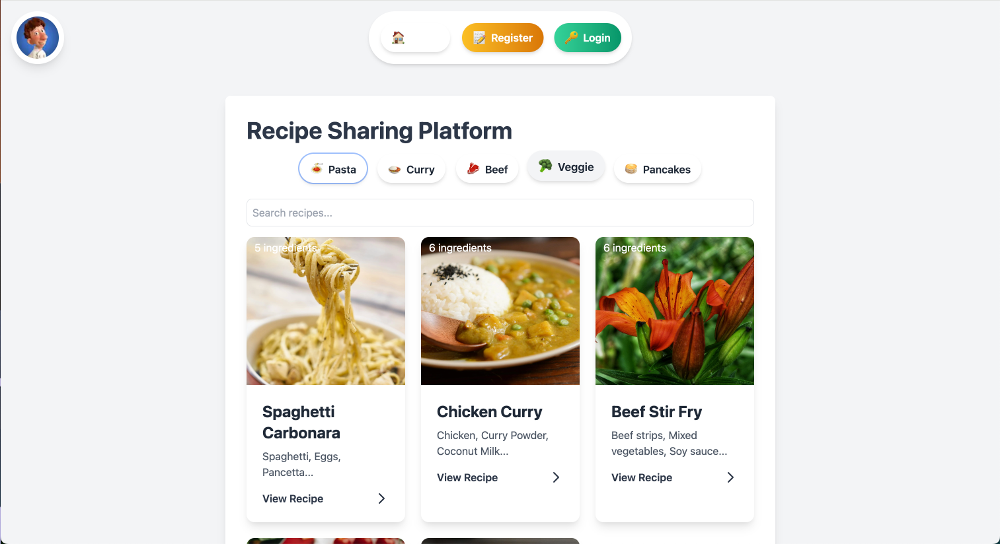
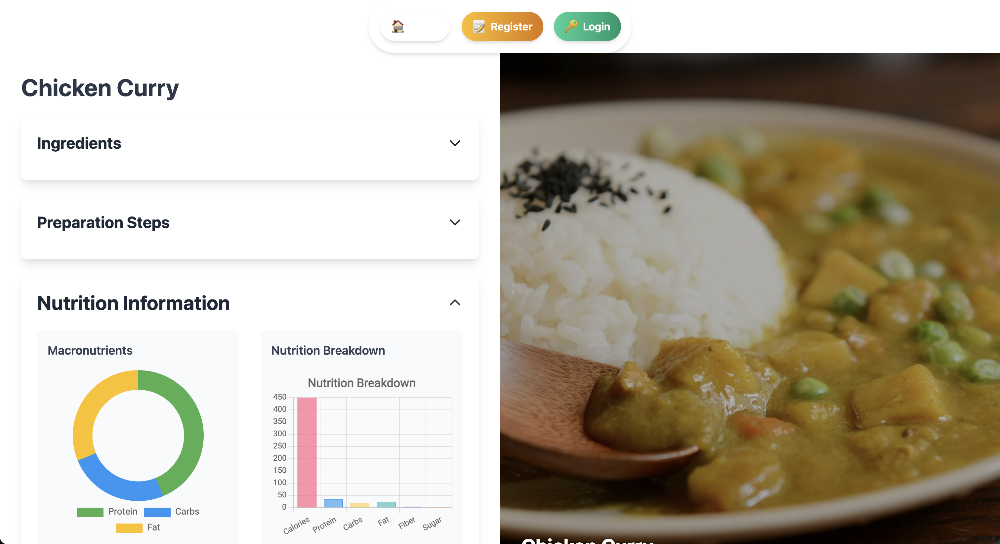
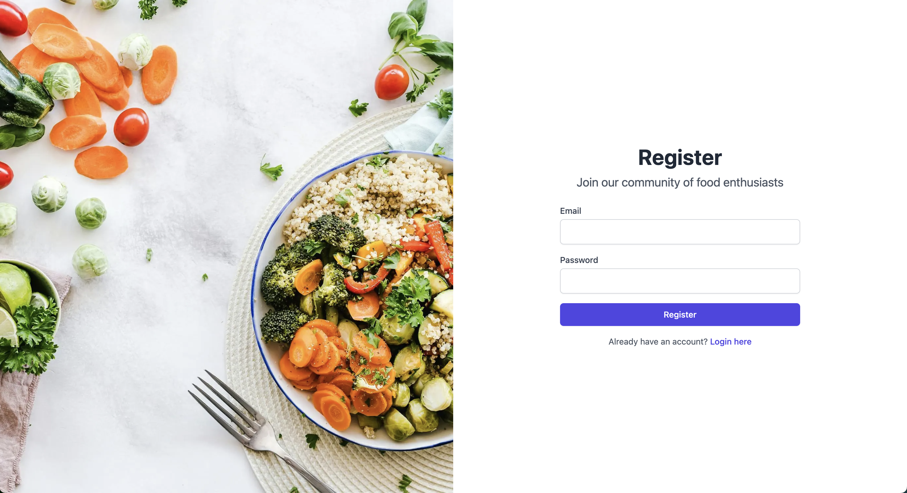

# 🍽️ Recipe Sharing Platform

Welcome to our Recipe Sharing Platform! 🎉 This delicious project is built with Next.js, Tailwind CSS, and Axios. Users can register, login, and share their favorite recipes.

## 🌟 Features

- 👤 User registration and login
- 🔍 Recipe search functionality
- 📖 Recipe details page
- 🔐 Authentication using JWT

## 🖼️ Previews

Here's a sneak peek of what our platform looks like:

### Home Page


### Recipe Detail


### Registration Page


## 🚀 Getting Started

### Prerequisites

- Node.js (v14 or later)
- npm or yarn

### Installation

1. Clone the repository:

   ```bash
   git clone <repository_url>
   cd recipe-sharing-platform
   ```

2. Install the dependencies:

   ```bash
   npm install
   # or
   yarn install
   ```

### 🏃‍♂️ Running the Development Server

To start the development server, run:

```bash
npm run dev
# or
yarn dev
```

Open [http://localhost:3000](http://localhost:3000) with your browser to see the application.

### 🏗️ Building for Production

To build the application for production, run:

```bash
npm run build
# or
yarn build
```

### 🚀 Starting the Production Server

After building the application, you can start the production server with:

```bash
npm start
# or
yarn start
```

### 🧹 Linting

To run the linter, use:

```bash
npm run lint
# or
yarn lint
```

## 📄 License

This project is licensed under the MIT License.

Happy cooking! 🍳👨‍🍳👩‍🍳
